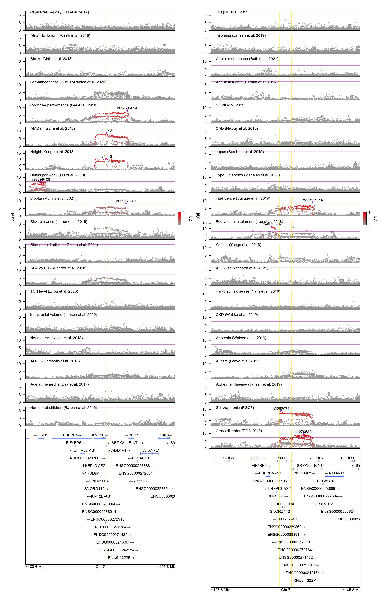

# GeneticsMakie

[](https://mmkim1210.github.io/GeneticsMakie.jl/stable)
[](https://mmkim1210.github.io/GeneticsMakie.jl/dev)
[](https://github.com/mmkim1210/GeneticsMakie.jl/actions)
[](https://codecov.io/gh/mmkim1210/GeneticsMakie.jl)

## Installation
```julia
julia>]
pkg> add https://github.com/mmkim1210/GeneticsMakie.jl.git
```

## Examples
```julia
using Pkg
Pkg.activate(@__DIR__)
Pkg.add(["CairoMakie", "Makie", "CSV", "DataFrames", "SnpArrays"])

using GeneticsMakie, CairoMakie, Makie.GeometryBasics, CSV, DataFrames, SnpArrays, Statistics

const GM = GeneticsMakie
CairoMakie.activate!(type = "png")
set_theme!(font = "Arial")

isdir("data") || mkdir("data")
isdir("figs") || mkdir("figs")

# Download the latest GENCODE annotation
gencode = let
    url = "https://ftp.ebi.ac.uk/pub/databases/gencode/Gencode_human/release_39/GRCh37_mapping/gencode.v39lift37.annotation.gtf.gz"
    file = basename(url)
    isdir("data/gencode") || mkdir("data/gencode")
    isfile("data/gencode/$(file)") || download(url, "data/gencode/$(file)")
    h = ["seqnames", "source", "feature", "start", "end", "score", "strand", "phase", "info"]
    CSV.read("data/gencode/$(file)", DataFrame; delim = "\t", comment = "#", header = h)
end
size(gencode) # 3_247_110 features

# Parse GENCODE
@time GM.parsegtf!(gencode)
select!(gencode, :seqnames, :feature, :start, :end, :strand, :gene_name, :gene_type, :transcript_id)

# Focus on KMT2E gene as an example
gene, window = "KMT2E", 1e6
chr, start, stop = GM.findgene(gene, gencode)
range1 = start - window
range2 = stop + window

# Visualize 1 Mb window around KMT2E
@time let
    f = Figure(resolution = (306, 792))
    ax = Axis(f[1, 1])
    rs = GM.plotgenes!(ax, chr, range1, range2, gencode; height = 0.1)
    vspan!(ax, start, stop; color = (:gray, 0.2))
    GM.labelgenome(f[1, 1, Bottom()], chr, range1, range2)
    rowsize!(f.layout, 1, rs)
    resize_to_layout!(f)
    save("figs/$(gene)-gene.png", f, px_per_unit = 4)
    display("image/png", read("figs/$(gene)-gene.png"))
end
```
<p align="center"></p>

```julia
# Highlight KMT2E and several nearby genes
@time let
    f = Figure(resolution = (306, 792))
    ax = Axis(f[1, 1])
    rs = GM.plotgenes!(ax, gene, (["KMT2E", "SRPK2", "ORC5", "ATXN7L1"], ["#4062D8", "#CB3C33", "#389826", "#9658B2"]), gencode; height = 0.1)
    GM.labelgenome(f[1, 1, Bottom()], chr, range1, range2)
    rowsize!(f.layout, 1, rs)
    resize_to_layout!(f)
    save("figs/$(gene)-gene-highlight.png", f, px_per_unit = 4)
    display("image/png", read("figs/$(gene)-gene-highlight.png"))
end
```
<p align="center"></p>

```julia
# Visualize KMT2E isoforms
@time let
    f = Figure(resolution = (306, 792))
    ax = Axis(f[1, 1])
    rs, chr, range1, range2= GM.plotisoforms!(ax, gene, gencode; height = 0.1)
    GM.labelgenome(f[1, 1, Bottom()], chr, range1, range2)
    rowsize!(f.layout, 1, rs)
    resize_to_layout!(f)
    save("figs/$(gene)-isoform.png", f, px_per_unit = 4)
    display("image/png", read("figs/$(gene)-isoform.png"))
end
```
<p align="center"></p>

```julia
# Visualize KMT2E and nearby isoforms simultaneously
@time let
    f = Figure(resolution = (612, 792))
    axs = [Axis(f[i, 1]) for i in 1:2]
    rs, _, range1, _ = GM.plotisoforms!(axs[1], gene, gencode; height = 0.1, genecolor = "#4062D8")
    rowsize!(f.layout, 1, rs)
    hidespines!(axs[1], :b)
    rs, _, _, range2 = GM.plotisoforms!(axs[2], "SRPK2", gencode; height = 0.1, genecolor = "#CB3C33")
    rowsize!(f.layout, 2, rs)
    hidespines!(axs[2], :t)
    xlims!(axs[1], range1 - 0.5e4, range2 - 1e4)
    xlims!(axs[2], range1 - 0.5e4, range2 - 1e4)
    GM.labelgenome(f[2, 1, Bottom()], chr, range1 - 0.5e4, range2 - 1e4)
    rowgap!(f.layout, 1, 0)
    resize_to_layout!(f)
    save("figs/$(gene)-isoform-others.png", f, px_per_unit = 4)
    display("image/png", read("figs/$(gene)-isoform-others.png"))
end
```
<p align="center"></p>

```julia
# Visualize KMT2E isoforms w/ expression
@time let
    f = Figure(resolution = (306, 792))
    axs = [Axis(f[1, i]) for i in 1:2]
    rs, chr, range1, range2 = GeneticsMakie.plotisoforms!(axs[1], gene, gencode; height = 0.1, textpos = :left)
    hidespines!(axs[1])
    rowsize!(f.layout, 1, rs)
    # Generate random single-cell expression levels
    n = length(unique(gencode[(gencode.feature .== "transcript") .& (gencode.gene_name .== gene), :transcript_id]))
    expr = abs.(randn(n, 6))
    expr = expr / maximum(expr)
    cell = ["Exc", "In", "End", "Mic", "OPC", "Oligo"]
    c = [Circle(Point2f(0.125 * j, 0.95 - (i - 1) * 0.125), expr[i, j] * 0.05) for i in 1:n, j in 1:6]
    poly!(axs[2], vec(c), color = vec(expr), colormap = :Purples_9)
    axs[2].xticks = ([0.125 * j for j in 1:6], cell)
    axs[2].xticklabelsize = 4
    axs[2].xticklabelrotation = π / 2
    axs[2].xaxisposition = :top
    axs[2].xticklabelpad = 0
    axs[2].aspect = DataAspect()
    xlims!(axs[2], 0, 0.125 * 7)
    ymin, ymax = 0.875 - (n - 1) * 0.125, 1.05
    ylims!(axs[2], ymin, ymax)
    colsize!(f.layout, 2, Aspect(1, 0.125 * 7 / (ymax - ymin)))
    hidespines!(axs[2])
    hidexdecorations!(axs[2], ticklabels = false)
    hideydecorations!(axs[2])
    Colorbar(f[2, 2], limits = (0, 100), ticks = 0:100:100, ticklabelsize = 3,
        tellwidth = false, vertical = false, flipaxis = false,
        colormap = :Purples_9, label = "% expressed", labelsize = 4,
        width = 10, spinewidth = 0.25, tickwidth = 0, height = 2, ticksize = 0)
    colgap!(f.layout, 2)
    rowgap!(f.layout, 5)
    resize_to_layout!(f)
    save("figs/$(gene)-expression.png", f, px_per_unit = 4)
    display("image/png", read("figs/$(gene)-expression.png"))
end
```
<p align="center"></p>

```julia
kgp = let
    # Download 1000 Genomes data for a single chromosome
    beagle = "http://bochet.gcc.biostat.washington.edu/beagle/1000_Genomes_phase3_v5a"
    url = joinpath(beagle, "b37.vcf/chr$(chr).1kg.phase3.v5a.vcf.gz")
    vcf = basename(url)
    isdir("data/1kg") || mkdir("data/1kg")
    isfile("data/1kg/$(vcf)") || download(url, "data/1kg/$(vcf)")
    # Convert vcf file to plink bed file (this step takes a while)
    isfile("data/1kg/$(replace(vcf, ".vcf.gz" => ".bed"))") || vcf2plink("data/1kg/$(vcf)", "data/1kg/$(replace(vcf, ".vcf.gz" => ""))")
    # Download sample metadata
    url = joinpath(beagle, "/sample_info/integrated_call_samples_v3.20130502.ALL.panel")
    meta = basename(url) 
    isfile("data/1kg/$(meta)") || download(url, "data/1kg/$(meta)")
    # Subset data to the genomic region of interest and European samples
    kgp = SnpData("data/1kg/$(replace(vcf, ".vcf.gz" => ""))")
    meta = CSV.read("data/1kg/$(meta)", DataFrame)
    eur = meta.sample[meta.super_pop .== "EUR"]
    colinds = findall((kgp.snp_info.position .>= range1) .& (kgp.snp_info.position .<= range2))
    rowinds = findall(in(eur), kgp.person_info.iid)
    file = replace(vcf, ".vcf.gz" => ".eur")
    SnpArrays.filter(kgp, rowinds, colinds; des = "data/1kg/$(file)")
    # Apply minor allele frequency > 0.05 filter
    kgp = SnpData("data/1kg/$(file)")
    colinds = SnpArrays.filter(kgp.snparray; min_maf = 0.05)[2]
    file = file * ".maf0.05"
    SnpArrays.filter(kgp, trues(size(kgp)[1]), colinds; des = "data/1kg/$(file)")
    SnpData("data/1kg/$(file)")
end 
size(kgp) # 503 European individuals + 5_574 SNPs

LD = let
    geno = convert(Matrix{Float64}, kgp.snparray)
    LD = cor(geno, dims = 1)
    LD.^2
end

# Visualize LD for KMT2E locus
@time let
    f = Figure(resolution = (306, 792))
    ax = Axis(f[1, 1])
    GM.plotld!(ax, LD; color = "green")
    GM.labelgenome(f[1, 1, Top()], chr, range1, range2)
    rowsize!(f.layout, 1, Aspect(1, 0.5))
    Colorbar(f[2, 1], limits = (0, 1), tellwidth = false, ticklabelsize = 6,
        colormap = cgrad(:Greens_9, 9, categorical = true),
        label = "LD", labelsize = 6, vertical = false, flipaxis = false,
        width = 40, spinewidth = 0.5, tickwidth = 0.5, height = 5, ticksize = 3)
    rowgap!(f.layout, 5)
    resize_to_layout!(f)
    save("figs/$(gene)-LD.png", f, px_per_unit = 4)
    display("image/png", read("figs/$(gene)-LD.png"))
end
```
<p align="center"></p>

```julia
# Visualize LD as a square for KMT2E locus
@time let
    xs = range(0, 10, length = size(LD, 1))
    ys = range(10, 0, length = size(LD, 1))
    f = Figure(resolution = (306 / sqrt(2), 792))
    ax = Axis(f[1, 1])
    heatmap!(ax, xs, ys, LD; colorrange = (0, 1), colormap = cgrad(:Greens_9, 9, categorical = true))
    hidedecorations!(ax)
    hidespines!(ax, :t, :r, :l)
    ax.spinewidth = 0.75
    ax.aspect = DataAspect()
    rowsize!(f.layout, 1, Aspect(1, 1))
    GM.labelgenome(f[1, 1, Bottom()], chr, range1, range2)
    resize_to_layout!(f)
    save("figs/$(gene)-LD-square.png", f, px_per_unit = 4)
    display("image/png", read("figs/$(gene)-LD-square.png"))
end
```
<p align="center"></p>

```julia
# Download GWAS summary statistics for psychiatric disorders
gwas = let
    gwas = Dict(
        "scz" => ("https://figshare.com/ndownloader/files/28169757", "PGC3_SCZ_wave3_public.v2.tsv.gz"),
        "bd" => ("https://figshare.com/ndownloader/files/26603681", "pgc-bip2021-all.vcf.tsv.gz"),
        "asd" => ("https://figshare.com/ndownloader/files/28169292", "iPSYCH-PGC_ASD_Nov2017.gz")
    )
    for key in keys(gwas)
        url = gwas[key][1]
        file = gwas[key][2]
        isdir("data/gwas") || mkdir("data/gwas")
        isfile("data/gwas/$(file)") || download(url, "data/gwas/$(file)")
    end
    scz = CSV.read("data/gwas/$(gwas["scz"][2])", DataFrame; comment = "##", missingstring = ["NA"])
    bd = CSV.read("data/gwas/$(gwas["bd"][2])", DataFrame; comment = "##", missingstring = ["NA"])
    asd = CSV.read("data/gwas/$(gwas["asd"][2])", DataFrame; comment = "##", missingstring = ["NA"])
    [scz, bd, asd]
end
titles = ["Schizophrenia (PGC3)", "Bipolar (Mullins et al. 2021)", "Autism (Grove et al. 2019)"]
@time GM.mungesumstats!(gwas)

# Visualize GWAS results for KMT2E locus
@time let
    n = length(gwas)
    f = Figure(resolution = (306, 792))
    axs = [Axis(f[i, 1]) for i in 1:(n + 1)]
    for i in 1:n
        GM.plotlocus!(axs[i], chr, range1, range2, gwas[i]; colorld = true, ref = kgp, ymax = 18)
        rowsize!(f.layout, i, 30)
        lines!(axs[i], [range1, range2], fill(-log(10, 5e-8), 2), color = (:purple, 0.5), linewidth = 0.5)
        Label(f[i, 1, Top()], "$(titles[i])", textsize = 6, halign = :left, padding = (7.5, 0, -5, 0))
    end
    rs = GM.plotgenes!(axs[n + 1], chr, range1, range2, gencode; height = 0.1)
    rowsize!(f.layout, n + 1, rs)
    GM.labelgenome(f[n + 1, 1, Bottom()], chr, range1, range2)
    Colorbar(f[1:n, 2], limits = (0, 1), ticks = 0:1:1, height = 20,
        colormap = (:gray60, :red2), label = "LD", ticksize = 0, tickwidth = 0,
        tickalign = 0, ticklabelsize = 6, flip_vertical_label = true,
        labelsize = 6, width = 5, spinewidth = 0.5)
    Label(f[1:n, 0], text = "-log[p]", textsize = 6, rotation = pi / 2)
    rowgap!(f.layout, 5)
    colgap!(f.layout, 5)
    for i in 1:(n + 1)
        vlines!(axs[i], start, color = (:gold, 0.5), linewidth = 0.5)
        vlines!(axs[i], stop, color = (:gold, 0.5), linewidth = 0.5)
    end
    resize_to_layout!(f)
    save("figs/$(gene)-locuszoom.png", f, px_per_unit = 4)
    display("image/png", read("figs/$(gene)-locuszoom.png"))
end
```
<p align="center"></p>

```julia
# Visualize Manhattan plot
@time let
    f = Figure(resolution = (408, 792))
    axs = [Axis(f[i, 1]) for i in 1:length(titles)]
    coord, ymaxs, xmax, ticks = GM.coordinategwas(gwas) # set up coordinates
    for i in eachindex(titles)
        GM.plotgwas!(axs[i], coord, i, ymaxs[i], xmax, ticks; xlabel = "", ystep = 10)
        hidespines!(axs[i], :t, :r)
        Label(f[i, 1, Top()], text = "$(titles[i])", textsize = 8)
        rowsize!(f.layout, i, 50)
        i == length(titles) ? axs[i].xlabel = "Chromosome" : nothing
    end
    rowgap!(f.layout, 10)
    resize_to_layout!(f)
    save("figs/manhattan.png", f, px_per_unit = 4)
    display("image/png", read("figs/manhattan.png"))
end
```
<p align="center"></p>

```julia
# Visualize Miami/Hudson plot
@time let
    f = Figure(resolution = (408, 792))
    axs = [Axis(f[i, 1]) for i in 1:2]
    coord, ymaxs, xmax, ticks = GM.coordinategwas(gwas[1:2])
    for i in 1:2
        GM.plotgwas!(axs[i], coord, i, ymaxs[i], xmax, ticks; xlabel = "", ystep = 10)
        rowsize!(f.layout, i, 50)
    end
    hidexdecorations!(axs[2])
    hidespines!(axs[1], :t, :r)
    hidespines!(axs[2], :b, :r)
    ylims!(axs[2], ymaxs[2], 0)
    Label(f[1, 1, Top()], text = "$(titles[1])", textsize = 8)
    Label(f[2, 1, Bottom()], text = "$(titles[2])", textsize = 8)
    rowgap!(f.layout, 1)
    resize_to_layout!(f)
    save("figs/miami.png", f, px_per_unit = 4)
    display("image/png", read("figs/miami.png"))
end
```
<p align="center"></p>

```julia
# Visualize QQ plot of P values
@time let
    f = Figure(resolution = (612, 792))
    axs = [Axis(f[2, i]) for i in 1:length(titles)]
    for i in eachindex(titles)
        GM.plotqq!(axs[i], gwas[i]; xlabel = "", ylabel = "", ystep = 5)
        ylims!(axs[i], 0, 40)
        i > 1 ? hideydecorations!(axs[i]) : nothing
    end
    for (i, title) in enumerate(titles)
        Box(f[1, i], color = :gray90)
        Label(f[1, i], title, tellwidth = false, textsize = 8, padding = (0, 0, 3, 3))
    end
    Label(f[3, 1:length(titles)], text = "Expected -log[p]", textsize = 8)
    Label(f[2, 0], text = "Observed -log[p]", textsize = 8, rotation = pi / 2, tellheight = false)
    rowsize!(f.layout, 2, Aspect(2, 1))
    colgap!(f.layout, 5)
    rowgap!(f.layout, 1, 0)
    rowgap!(f.layout, 2, 5)
    resize_to_layout!(f)
    save("figs/QQ.png", f, px_per_unit = 4)
    display("image/png", read("figs/QQ.png"))
end
```
<p align="center"></p>

## Further examples
Patterns of association and LD:
<p align="center"></p>
Colocalization of GWAS signals:
<p align="center"></p>
Association results across multiple phenotypes:
<p align="center"></p>