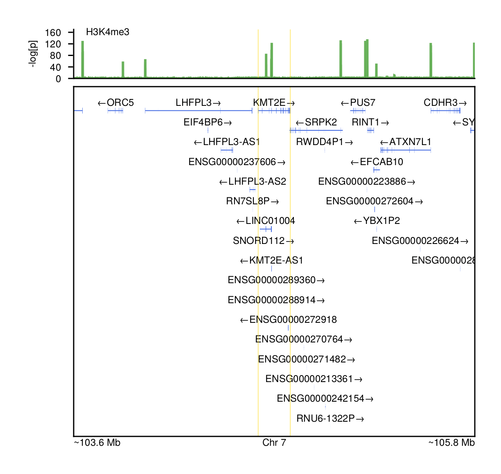
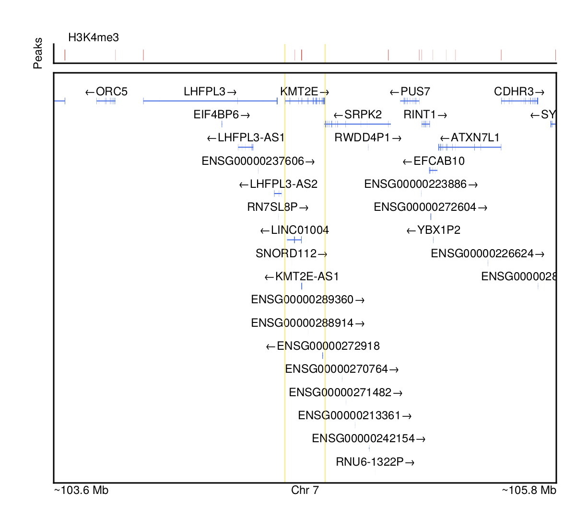
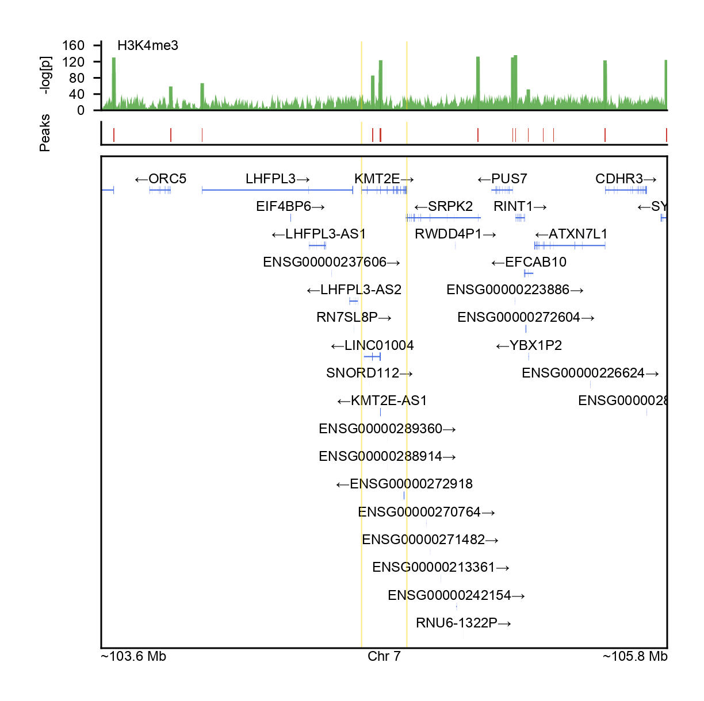

# Plotting ChIP-seq and ATAC-seq

Epigenetic sequencing is another data modality of interest that we can
visualize with [__Makie.jl__](https://makie.juliaplots.org/stable/) and
GeneticsMakie.jl. Chromatin immunoprecipitation sequencing (ChIP-seq) and assay
for transposase-accessible chromatin with high-throughput sequencing (ATAC-seq)
map epigenetic modifications throughout the genome by identifying DNA-protein
interaction sites and open chromatin respectively, and although they capture
different aspects of the epigenome, their resulting data share the same form
and function (BAM files to capture reads, wiggle files to capture coverage and
signal, BED files to capture peaks). Consequently, visualizing both types of
sequencing will follow the same workflow.

We will start with the annotation from [Parsing GENCODE](@ref). Accompanying
ChIP-seq data will be downloaded from the
[ENCODE project](https://www.encodeproject.org/).

```julia
using Pkg
Pkg.add(["GeneticsMakie", "CairoMakie", "CSV", "DataFrames", "Arrow", "BigWig"])
```

```julia
using GeneticsMakie, CairoMakie, CSV, DataFrames, Arrow, Downloads, BigWig
chipseq = Dict(
    "continuous" => "https://www.encodeproject.org/files/ENCFF343VSH/@@download/ENCFF343VSH.bigWig",
    "peaks" => "https://www.encodeproject.org/files/ENCFF938RRM/@@download/ENCFF938RRM.bed.gz"
)
isdir("data/chipseq") || mkdir("data/chipseq")
for key in keys(chipseq)
    url = chipseq[key]
    isfile("data/chipseq/$(basename(url))") || Downloads.download(url, "data/chipseq/$(basename(url))")
end
url = "https://ftp.ebi.ac.uk/pub/databases/gencode/Gencode_human/release_39/GRCh37_mapping/gencode.v39lift37.annotation.gtf.gz"
gencode = Arrow.Table("data/gencode/$(splitext(basename(url))[1]).arrow")|> DataFrame
```

We can generate a track visualizing ChIP-seq data continuously over a locus.
Here we plot the the p-value from processing the ChiP-seq data through
[MACS2](https://pypi.org/project/MACS2/) for rejecting the null hypothesis that
the signal at that site is also present in the control. Continuous data like
this is often stored in bigWig files, which store dense, continuous data in
indexed binary files. Other types of continuous data can be stored and
delivered through this format; BAM files can be converted to the bigWig format
in order to convey read coverage over the genome. We will use the
[__BigWig.jl__](https://biojulia.net/BigWig.jl/dev/) package to read in this
data to plot.

```julia
gene = "KMT2E"
chr, start, stop = GeneticsMakie.findgene(gene, gencode)
ranges = [start - 1e6, stop + 1e6]

f = Figure(resolution = (306, 792))
axs = [Axis(f[i, 1]) for i in 1:2]
# Generate continuous plot of signal p-values
let
    ax = axs[1]
    reader = open(BigWig.Reader, "data/chipseq/$(basename(chipseq["continuous"]))")
    xs = Float64[]
    ys = Float64[]
    for record in BigWig.GenomicFeatures.eachoverlap(reader,
        BigWig.Interval("chr$(chr)", Int64(ranges[1]), Int64(ranges[2])))
        # Extract position
        push!(xs, BigWig.chromstart(record))
        # Extract -log₁₀(p)
        push!(ys, BigWig.value(record))
    end
    band!(ax, xs, fill(0, length(xs)), ys; color = ("#389826", 0.75))
    lines!(ax, xs, ys; color = ("#389826", 0.75))
    rowsize!(f.layout, 1, 30)
    close(reader)
    Label(f[1, 1, Top()], "H3K4me3", textsize = 6, halign = :left, padding = (7.5, 0, -5, 0))
    # Tidy up the axes
    ymax = max(10, maximum(ys) * 1.25)
    ax.spinewidth = 0.75
    ax.ytickwidth = 0.75
    ax.ylabelsize = 6
    ax.yticklabelsize = 6
    ax.yticksize = 3
    if ymax == 10
        ax.yticks = 0:3:10
    elseif 10 < ymax <= 20
        ax.yticks = 0:5:ymax
    elseif 20 < ymax <= 50
        ax.yticks =  0:10:ymax
    else
        s = div(ymax, 4)
        d, r = divrem(s, 10)
        if r < 5 
            ax.yticks = (0:10d:ymax)
        else
            ax.yticks = (0:((d + 1) * 10):ymax)
        end
    end
    xlims!(ax, ranges[1], ranges[2])
    ylims!(ax, 0, ymax)
    hidespines!(ax, :t, :r)
    hidexdecorations!(ax)
    hideydecorations!(ax, ticks = false, label = false, ticklabels = false)
end
# Plot genes and adjust formatting
rs = GeneticsMakie.plotgenes!(axs[2], chr, ranges[1], ranges[2], gencode; height = 0.1)
rowsize!(f.layout, 2, rs)
GeneticsMakie.labelgenome(f[2, 1, Bottom()], chr, ranges[1], ranges[2])
Label(f[1, 0], text = "-log[p]", textsize = 6, rotation = pi / 2)
rowgap!(f.layout, 5)
colgap!(f.layout, 5)
for i in 1:2
    vlines!(axs[i], start, color = (:gold, 0.5), linewidth = 0.5)
    vlines!(axs[i], stop, color = (:gold, 0.5), linewidth = 0.5)
end
resize_to_layout!(f)
f
```


An alternative way to visualize ChIP-seq data is by drawing the peaks only.
There are various tools for calling peaks, and for the most part they output
the peaks in a BED file or a similar format. Here we load in and draw peaks
called by [MACS2](https://pypi.org/project/MACS2/).

```julia
using Makie.GeometryBasics
f = Figure(resolution = (306, 792))
axs = [Axis(f[i, 1]) for i in 1:2]
# Generate plot of peaks
let
    ax = axs[1]
    narrowpeak_header =
    [:chrom, :start, :stop, :name, :score, :strand,
     :signalvalue, :nlog₁₀pvalue, :nlog₁₀qvalue, :peak]
    df = CSV.read("data/chipseq/$(basename(chipseq["peaks"]))", DataFrame;
                  header = narrowpeak_header)
    subset!(df,
            :chrom => col -> col .== "chr$(chr)",
            [:start, :stop] =>
            (start, stop) ->
            (start .< ranges[2]) .&& (stop .> ranges[1]))
    for row in eachrow(df)
        peakpoly = Polygon(Point2f[(row.start, 0),
                                   (row.start, 10),
                                   (row.stop, 10),
                                   (row.stop, 0)])
        poly!(ax, peakpoly; color = "#CB3C33")
    end
    ax.spinewidth = 0.75
    hidexdecorations!(ax)
    hideydecorations!(ax)
    xlims!(ax, ranges[1], ranges[2])
    ylims!(ax, -10 * .25, 10 * 1.5)
    hidespines!(ax, :t, :r)
    rowsize!(f.layout, 1, 10)
end
# Plot genes and adjust formatting
rs = GeneticsMakie.plotgenes!(axs[2], chr, ranges[1], ranges[2], gencode; height = 0.1)
rowsize!(f.layout, 2, rs)
GeneticsMakie.labelgenome(f[2, 1, Bottom()], chr, ranges[1], ranges[2])
Label(f[1, 0], text = "Peaks", textsize = 6, rotation = pi / 2)
Label(f[0, 2], "H3K4me3", textsize = 6, halign = :left, padding = (7.5, 0, -5, 0), tellwidth = false)
rowgap!(f.layout, 5)
colgap!(f.layout, 5)
for i in 1:2
    vlines!(axs[i], start, color = (:gold, 0.5), linewidth = 0.5)
    vlines!(axs[i], stop, color = (:gold, 0.5), linewidth = 0.5)
end
resize_to_layout!(f)
f
```


Using [__Makie.jl__](https://makie.juliaplots.org/stable/)'s layout tools, we
can visualize both the continuous track and the called peaks simultaneously.

```julia
f = Figure(resolution = (306, 792))
axs = [Axis(f[i, 1]) for i in 1:3]
# Generate continuous plot of signal p-values
let
    ax = axs[1]
    reader = open(BigWig.Reader, "data/chipseq/$(basename(chipseq["continuous"]))")
    xs = Float64[]
    ys = Float64[]
    for record in BigWig.GenomicFeatures.eachoverlap(reader,
        BigWig.Interval("chr$(chr)", Int64(ranges[1]), Int64(ranges[2])))
        # Extract position
        push!(xs, BigWig.chromstart(record))
        # Extract -log₁₀(p)
        push!(ys, BigWig.value(record))
    end
    band!(ax, xs, fill(0, length(xs)), ys; color = ("#389826", 0.75))
    lines!(ax, xs, ys; color = ("#389826", 0.75))
    rowsize!(f.layout, 1, 30)
    close(reader)
    Label(f[1, 1, Top()], "H3K4me3", textsize = 6, halign = :left, padding = (7.5, 0, -5, 0))
    # Tidy up the axes
    ymax = max(10, maximum(ys) * 1.25)
    ax.spinewidth = 0.75
    ax.ytickwidth = 0.75
    ax.ylabelsize = 6
    ax.yticklabelsize = 6
    ax.yticksize = 3
    if ymax == 10
        ax.yticks = 0:3:10
    elseif 10 < ymax <= 20
        ax.yticks = 0:5:ymax
    elseif 20 < ymax <= 50
        ax.yticks =  0:10:ymax
    else
        s = div(ymax, 4)
        d, r = divrem(s, 10)
        if r < 5 
            ax.yticks = (0:10d:ymax)
        else
            ax.yticks = (0:((d + 1) * 10):ymax)
        end
    end
    xlims!(ax, ranges[1], ranges[2])
    ylims!(ax, 0, ymax)
    hidespines!(ax, :t, :r)
    hidexdecorations!(ax)
    hideydecorations!(ax, ticks = false, label = false, ticklabels = false)
end
# Generate plot of peaks
let
    ax = axs[2]
    narrowpeak_header =
    [:chrom, :start, :stop, :name, :score, :strand,
     :signalvalue, :nlog₁₀pvalue, :nlog₁₀qvalue, :peak]
    df = CSV.read("data/chipseq/$(basename(chipseq["peaks"]))", DataFrame;
                  header = narrowpeak_header)
    subset!(df,
            :chrom => col -> col .== "chr$(chr)",
            [:start, :stop] =>
            (start, stop) ->
            (start .< ranges[2]) .&& (stop .> ranges[1]))
    for row in eachrow(df)
        peakpoly = Polygon(Point2f[(row.start, 0),
                                   (row.start, 10),
                                   (row.stop, 10),
                                   (row.stop, 0)])
        poly!(ax, peakpoly; color = "#CB3C33")
    end
    ax.spinewidth = 0.75
    hidexdecorations!(ax)
    hideydecorations!(ax)
    xlims!(ax, ranges[1], ranges[2])
    ylims!(ax, -10 * .25, 10 * 1.5)
    hidespines!(ax, :t, :r)
    rowsize!(f.layout, 2, 10)
end
# Plot genes and adjust formatting
rs = GeneticsMakie.plotgenes!(axs[3], chr, ranges[1], ranges[2], gencode; height = 0.1)
rowsize!(f.layout, 3, rs)
GeneticsMakie.labelgenome(f[3, 1, Bottom()], chr, ranges[1], ranges[2])
Label(f[1, 0], text = "-log[p]", textsize = 6, rotation = pi / 2)
Label(f[2, 1], text = "Peaks", textsize = 6, rotation = pi / 2)
rowgap!(f.layout, 5)
colgap!(f.layout, 5)
for i in 1:3
    vlines!(axs[i], start, color = (:gold, 0.5), linewidth = 0.5)
    vlines!(axs[i], stop, color = (:gold, 0.5), linewidth = 0.5)
end
resize_to_layout!(f)
f
```


