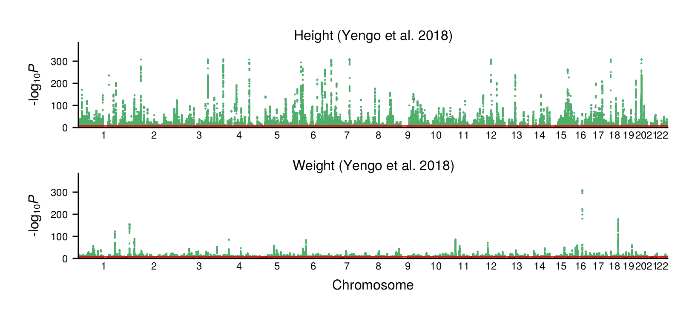

# Plotting GWAS

After [Munging summary statistics](@ref), we can use `GeneticsMakie.plotgwas!` 
to draw Manhattan plots.

```julia
using Pkg
Pkg.add(["GeneticsMakie", "CairoMakie", "DataFrames", "Arrow"])
```

```julia
using GeneticsMakie, CairoMakie, DataFrames, Arrow
dfs = DataFrame[]
for key in ["height", "weight"]
    push!(dfs, Arrow.Table("data/gwas/$(key).arrow")|> DataFrame)
end
titles = ["Height (Yengo et al. 2018)", "Weight (Yengo et al. 2018)"]
```

```julia
f = Figure(size = (408, 792))
axs = [Axis(f[i, 1]) for i in 1:length(titles)]
for i in eachindex(titles)
    GeneticsMakie.plotgwas!(axs[i], dfs[i])
    hidespines!(axs[i], :t, :r)
    Label(f[i, 1, Top()], text = "$(titles[i])", fontsize = 8)
    rowsize!(f.layout, i, 50)
    i == length(titles) ? axs[i].xlabel = "Chromosome" : axs[i].xlabel = ""
end
rowgap!(f.layout, 10)
resize_to_layout!(f)
f
```


By default, `GeneticsMakie.plotgwas!` highlights the genome-wide significant threshold
and corresponding significant variants. We can turn off this option by using the `linecolor` and `scattercolor` keyword arguments. 

```julia
f = Figure(size = (408, 792))
axs = [Axis(f[i, 1]) for i in 1:length(titles)]
for i in eachindex(titles)
    GeneticsMakie.plotgwas!(axs[i], dfs[i]; linecolor = nothing, scattercolor = nothing)
    hidespines!(axs[i], :t, :r)
    Label(f[i, 1, Top()], text = "$(titles[i])", fontsize = 8)
    rowsize!(f.layout, i, 50)
    i == length(titles) ? axs[i].xlabel = "Chromosome" : axs[i].xlabel = ""
end
rowgap!(f.layout, 10)
resize_to_layout!(f)
f
```


We can color even and odd chromosomes with different colors by using the `chromcolors` keyword argument. 

```julia
f = Figure(size = (408, 792))
axs = [Axis(f[i, 1]) for i in 1:length(titles)]
for i in eachindex(titles)
    GeneticsMakie.plotgwas!(axs[i], dfs[i]; linecolor = nothing, scattercolor = nothing, 
        chromcolors = ["#389826", "#9658B2"])
    hidespines!(axs[i], :t, :r)
    Label(f[i, 1, Top()], text = "$(titles[i])", fontsize = 8)
    rowsize!(f.layout, i, 50)
    i == length(titles) ? axs[i].xlabel = "Chromosome" : axs[i].xlabel = ""
end
rowgap!(f.layout, 10)
resize_to_layout!(f)
f
```


We can then use `GeneticsMakie.plotqq!` to draw QQ plots.
```julia
f = Figure(size = (408, 792))
axs = [Axis(f[2, i]) for i in 1:length(titles)]
for i in eachindex(titles)
    GeneticsMakie.plotqq!(axs[i], dfs[i]; ystep = 5)
    axs[i].xlabel = ""
    axs[i].ylabel = ""
    ylims!(axs[i], 0, 40)
    i > 1 ? hideydecorations!(axs[i]) : nothing
end
for (i, title) in enumerate(titles)
    Box(f[1, i], color = :gray90)
    Label(f[1, i], title, tellwidth = false, fontsize = 8, padding = (0, 0, 3, 3))
end
Label(f[3, 1:length(titles)], text = "Expected -log[p]", fontsize = 8)
Label(f[2, 0], text = "Observed -log[p]", fontsize = 8, rotation = pi / 2, tellheight = false)
rowsize!(f.layout, 2, Aspect(2, 1))
colgap!(f.layout, 5)
rowgap!(f.layout, 1, 0)
rowgap!(f.layout, 2, 5)
resize_to_layout!(f)
f
```
