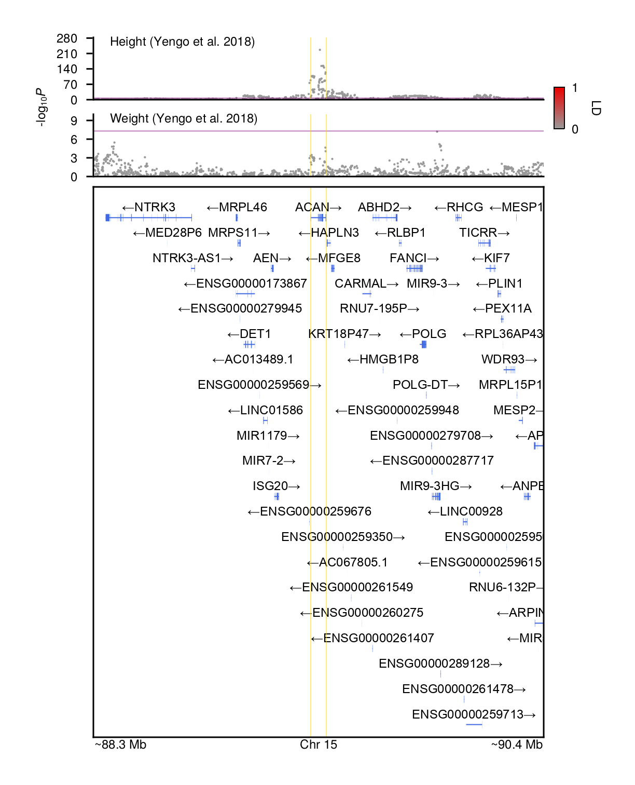
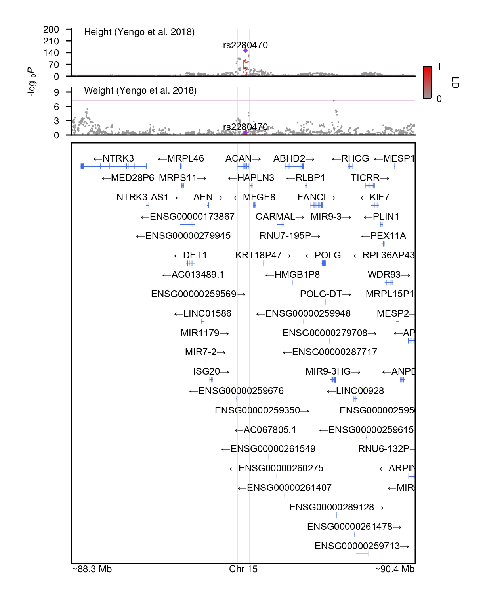

# Plotting LocusZooom

After [Parsing GENCODE](@ref) and [Munging summary statistics](@ref),
we can now put the pieces together to draw the backbone of a LocusZoom plot. 
We focus on _ACAN_ locus as an example, which reaches strong genome-wide significance
in GWAS for height. By default, `GeneticsMakie.plotlocus!` returns a straightforward scatter plot.

```julia
using Pkg
Pkg.add(["GeneticsMakie", "CairoMakie", "DataFrames", "Arrow", "SnpArrays"])
```

```julia
using GeneticsMakie, CairoMakie, DataFrames, Arrow, SnpArrays, Downloads
dfs = DataFrame[]
for key in ["height", "weight"]
    push!(dfs, Arrow.Table("data/gwas/$(key).arrow")|> DataFrame)
end
url = "https://ftp.ebi.ac.uk/pub/databases/gencode/Gencode_human/release_39/GRCh37_mapping/gencode.v39lift37.annotation.gtf.gz"
gencode = Arrow.Table("data/gencode/$(splitext(basename(url))[1]).arrow")|> DataFrame
GeneticsMakie.findclosestgene(GeneticsMakie.findgwasloci(dfs[1]), gencode)
```

```julia
gene = "ACAN"
chr, start, stop = GeneticsMakie.findgene(gene, gencode)
ranges = [start - 1e6, stop + 1e6]

n = length(dfs)
titles = ["Height (Yengo et al. 2018)", "Weight (Yengo et al. 2018)"]
f = Figure(resolution = (306, 792))
axs = [Axis(f[i, 1]) for i in 1:(n + 1)]
for i in 1:n
    GeneticsMakie.plotlocus!(axs[i], chr, ranges[1], ranges[2], dfs[i])
    rowsize!(f.layout, i, 30)
    lines!(axs[i], ranges, fill(-log(10, 5e-8), 2), color = (:purple, 0.5), linewidth = 0.5)
    Label(f[i, 1, Top()], "$(titles[i])", textsize = 6, halign = :left, padding = (7.5, 0, -5, 0))
end
rs = GeneticsMakie.plotgenes!(axs[n + 1], chr, ranges[1], ranges[2], gencode; height = 0.1)
rowsize!(f.layout, n + 1, rs)
GeneticsMakie.labelgenome(f[n + 1, 1, Bottom()], chr, ranges[1], ranges[2])
Colorbar(f[1:n, 2], limits = (0, 1), ticks = 0:1:1, height = 20,
    colormap = (:gray60, :red2), label = "LD", ticksize = 0, tickwidth = 0,
    tickalign = 0, ticklabelsize = 6, flip_vertical_label = true,
    labelsize = 6, width = 5, spinewidth = 0.5)
Label(f[1:n, 0], text = "-log[p]", textsize = 6, rotation = pi / 2)
rowgap!(f.layout, 5)
colgap!(f.layout, 5)
for i in 1:(n + 1)
    vlines!(axs[i], start, color = (:gold, 0.5), linewidth = 0.5)
    vlines!(axs[i], stop, color = (:gold, 0.5), linewidth = 0.5)
end
resize_to_layout!(f)
f
```


To color variants by linkage disequilibrium (LD), we need a reference panel. If we already have
one, we can use [__SnpArrays.jl__](https://openmendel.github.io/SnpArrays.jl/latest/) to
read in PLINK bed files.

```julia
isdir("data/1kg") || mkdir("data/1kg")
for plink in ["bed", "bim", "fam"]
    Downloads.download("https://github.com/mmkim1210/GeneticsMakieExamples/raw/master/data/kgp.chr15.$(plink)", "data/1kg/kgp.chr15.$(plink)")
end
kgp = SnpData("data/1kg/kgp.chr15")
```

We can color variants by LD with the index/sentinel SNP by using the `ld` keyword argument.

```julia
f = Figure(resolution = (306, 792))
axs = [Axis(f[i, 1]) for i in 1:(n + 1)]
for i in 1:n
    GeneticsMakie.plotlocus!(axs[i], chr, ranges[1], ranges[2], dfs[i]; ld = kgp)
    rowsize!(f.layout, i, 30)
    lines!(axs[i], ranges, fill(-log(10, 5e-8), 2), color = (:purple, 0.5), linewidth = 0.5)
    Label(f[i, 1, Top()], "$(titles[i])", textsize = 6, halign = :left, padding = (7.5, 0, -5, 0))
end
rs = GeneticsMakie.plotgenes!(axs[n + 1], chr, ranges[1], ranges[2], gencode; height = 0.1)
rowsize!(f.layout, n + 1, rs)
GeneticsMakie.labelgenome(f[n + 1, 1, Bottom()], chr, ranges[1], ranges[2])
Colorbar(f[1:n, 2], limits = (0, 1), ticks = 0:1:1, height = 20,
    colormap = (:gray60, :red2), label = "LD", ticksize = 0, tickwidth = 0,
    tickalign = 0, ticklabelsize = 6, flip_vertical_label = true,
    labelsize = 6, width = 5, spinewidth = 0.5)
Label(f[1:n, 0], text = "-log[p]", textsize = 6, rotation = pi / 2)
rowgap!(f.layout, 5)
colgap!(f.layout, 5)
for i in 1:(n + 1)
    vlines!(axs[i], start, color = (:gold, 0.5), linewidth = 0.5)
    vlines!(axs[i], stop, color = (:gold, 0.5), linewidth = 0.5)
end
resize_to_layout!(f)
f
```


We can also color variants by LD with the same SNP by using the `ld` keyword argument.

```julia
f = Figure(resolution = (306, 792))
axs = [Axis(f[i, 1]) for i in 1:(n + 1)]
for i in 1:n
    GeneticsMakie.plotlocus!(axs[i], chr, ranges[1], ranges[2], dfs[i]; ld = (kgp, ("15", 89395626)))
    rowsize!(f.layout, i, 30)
    lines!(axs[i], ranges, fill(-log(10, 5e-8), 2), color = (:purple, 0.5), linewidth = 0.5)
    Label(f[i, 1, Top()], "$(titles[i])", textsize = 6, halign = :left, padding = (7.5, 0, -5, 0))
end
rs = GeneticsMakie.plotgenes!(axs[n + 1], chr, ranges[1], ranges[2], gencode; height = 0.1)
rowsize!(f.layout, n + 1, rs)
GeneticsMakie.labelgenome(f[n + 1, 1, Bottom()], chr, ranges[1], ranges[2])
Colorbar(f[1:n, 2], limits = (0, 1), ticks = 0:1:1, height = 20,
    colormap = (:gray60, :red2), label = "LD", ticksize = 0, tickwidth = 0,
    tickalign = 0, ticklabelsize = 6, flip_vertical_label = true,
    labelsize = 6, width = 5, spinewidth = 0.5)
Label(f[1:n, 0], text = "-log[p]", textsize = 6, rotation = pi / 2)
rowgap!(f.layout, 5)
colgap!(f.layout, 5)
for i in 1:(n + 1)
    vlines!(axs[i], start, color = (:gold, 0.5), linewidth = 0.5)
    vlines!(axs[i], stop, color = (:gold, 0.5), linewidth = 0.5)
end
resize_to_layout!(f)
f
```


By using [__Makie.jl__](https://makie.juliaplots.org/stable/)'s layout tools, 
it becomes easy to draw additional tracks. For example, in a separate track, 
the variants could be colored or could have varying sizes depending on their minor allele frequency. 
In another example, the variants could be colored based on their inclusion in a 
credible set post-fine-mapping.

!!! note "Plotting the intersection of SNPs, not the union"
    `GeneticsMakie.plotlocus!` plots only the variants that are present in the reference panel, 
    when the `ld` keyword argument is specified. Although SNPs that are missing in the
    reference panel could be plotted differently (e.g. with varying transparency and shape),
    [__GeneticsMakie.jl__](https://github.com/mmkim1210/GeneticsMakie.jl) is designed to
    visualize 100s of phenotypes simultaneously in which case such discrepancy is hard to tell and 
    is confusing. Hence, for more direct comparison of loci across phenotypes, 
    only the variants that are found in the reference panel are shown.

!!! warning "Extremely small P values"
    There are several GWAS loci that harbor extremely small P values, in which cases
    the P values will be clamped to the smallest floating point number.
    Such cases are going to be more common in phenotypes that are reaching saturation
    in terms of GWAS discovery (e.g. height). In those cases, it is more commonplace to
    observe allelic heterogneity, and it might be more appropriate to
    plot alternative measures of strength of association (e.g. Z scores).

!!! note "Patterns of LD"
    Oftentimes, chunks of LD blocks hug a single or multiple gene boundaries.

!!! tip "Covering the entire genome"
    Visualizing 1,500 genomic regions with 2 Mb window will more or less cover the
    entire human genome. Note that empirically speaking, the probability of an arbitrary 2 Mb window 
    harboring at least one genome-wide significant hit across multiple phenotypes is 
    higher than not harboring any significant association.

!!! note "Phenome-scale LocusZoom"
    To visualize 100s of phenotypes simultaneously, summary statistics or other
    relevant genomic annotations should be converted to memory friendly 
    [__Arrow.jl__](https://github.com/apache/arrow-julia) or 
    [__Parquet.jl__](https://github.com/JuliaIO/Parquet.jl) files.