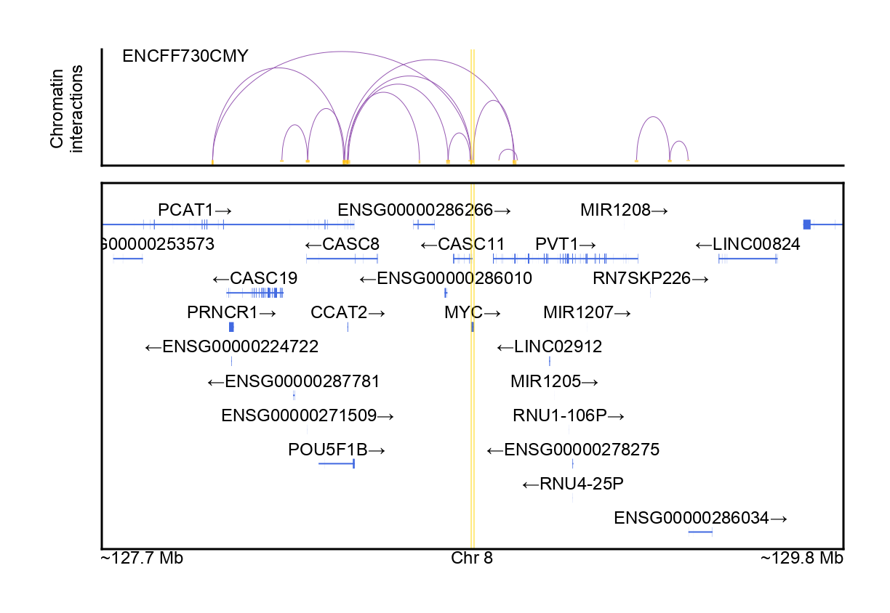
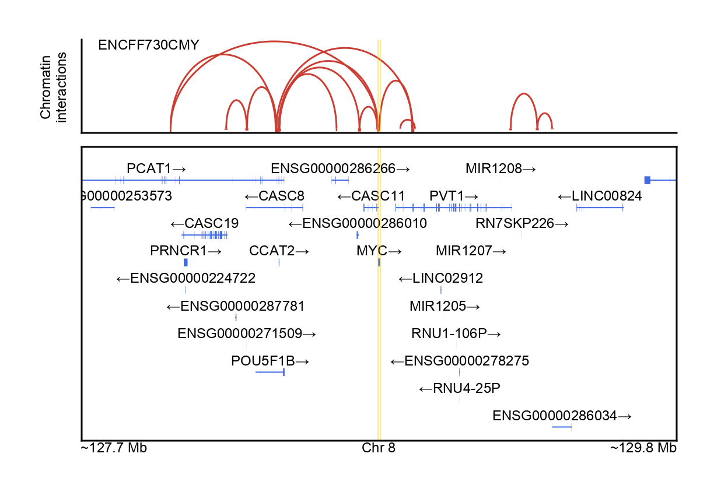
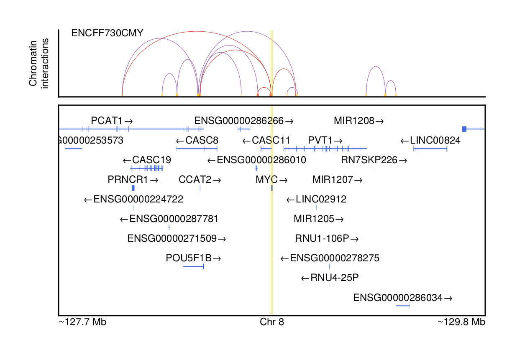

# Plotting loops

Additionally, we can visualize long-range DNA interactions captured by ChIA-PET
and Hi-C sequencing. A new track with these DNA interactions can be added upon
the GENCODE annotations we have processed from [Parsing GENCODE](@ref).
As an example, we focus on the _MYC_ locus in mammary epithelial cells,
which has long-range enhancers that are implicated in various epithelial
cancers ([Spitz et al. 2016](https://doi.org/10.1016/j.semcdb.2016.06.017)).
In order to visualize loops within this locus, we will download long-range
chromatin interactions provided by the ENCODE project.

```julia
using Pkg
Pkg.add(["GeneticsMakie", "CairoMakie", "CSV", "DataFrames", "Arrow"])
```

```julia
using GeneticsMakie, CairoMakie, CSV, DataFrames, Arrow, Downloads
isdir("data/loops") || mkdir("data/loops")
url = "https://www.encodeproject.org/files/ENCFF730CMY/@@download/ENCFF730CMY.bedpe.gz"
if !isfile("data/loops/$(splitext(basename(url))[1]).arrow")
    isfile("data/loops/$(basename(url))") ||
    Downloads.download(url, "data/loops/$(basename(url))")
    df = CSV.read("data/loops/$(basename(url))", DataFrame;
                  delim = "\t", skipto = 2, header = 0)
    # Select relevant columns and harmonize chromosomes with GENCODE
    select!(df,
            :Column1 => (col -> replace.(col, "chr" => "")) => :chr1,
            :Column2 => :x1, :Column3 => :x2,
            :Column4 => (col -> replace.(col, "chr" => "")) => :chr2,
            :Column5 => :y1, :Column6 => :y2,
            :Column8 => :score)
    Arrow.write("data/loops/$(splitext(basename(url))[1]).arrow", df)
end
dfs = [Arrow.Table("data/loops/$(splitext(basename(url))[1]).arrow") |> DataFrame]
url = "https://ftp.ebi.ac.uk/pub/databases/gencode/Gencode_human/release_39/GRCh37_mapping/gencode.v39lift37.annotation.gtf.gz"
gencode = Arrow.Table("data/gencode/$(splitext(basename(url))[1]).arrow")|> DataFrame
```

```julia
gene = "MYC"
chr, start, stop = GeneticsMakie.findgene(gene, gencode)
ranges = [start - 1e6, stop + 1e6]
n = length(dfs)
titles = ["ENCFF730CMY"]

f = Figure(resolution = (306, 792))
axs = [Axis(f[i, 1]) for i in 1:(n + 1)]
for i in 1:n
    GeneticsMakie.plotloops!(axs[i], chr, ranges[1], ranges[2], dfs[i])
    rowsize!(f.layout, i, 40)
    Label(f[i, 1, Top()], "$(titles[i])", textsize = 6, halign = :left, padding = (7.5, 0, -5, 0))
end
rs = GeneticsMakie.plotgenes!(axs[n + 1], chr, ranges[1], ranges[2], gencode; height = 0.1)
rowsize!(f.layout, n + 1, rs)
GeneticsMakie.labelgenome(f[n + 1, 1, Bottom()], chr, ranges[1], ranges[2])
Label(f[1:n, 0], text = "Chromatin\ninteractions", textsize = 6, rotation = pi / 2)
rowgap!(f.layout, 5)
colgap!(f.layout, 5)
for i in 1:(n + 1)
    vlines!(axs[i], start, color = (:gold, 0.5), linewidth = 0.5)
    vlines!(axs[i], stop, color = (:gold, 0.5), linewidth = 0.5)
end
resize_to_layout!(f)
f
```


We can change the color of the loops using the `colorarc` and `colorend`
keywords, which color the loops' arcs and paired ends respectively.
Additionally, we can change the line width of the loops using the `linewidth`
keyword.

```julia
f = Figure(resolution = (306, 792))
axs = [Axis(f[i, 1]) for i in 1:(n + 1)]
for i in 1:n
    GeneticsMakie.plotloops!(axs[i], chr, ranges[1], ranges[2], dfs[i];
    linewidth = 0.75, colorarc = "#CB3C33", colorend = "#CB3C33")
    rowsize!(f.layout, i, 40)
    Label(f[i, 1, Top()], "$(titles[i])", textsize = 6, halign = :left, padding = (7.5, 0, -5, 0))
end
rs = GeneticsMakie.plotgenes!(axs[n + 1], chr, ranges[1], ranges[2], gencode; height = 0.1)
rowsize!(f.layout, n + 1, rs)
GeneticsMakie.labelgenome(f[n + 1, 1, Bottom()], chr, ranges[1], ranges[2])
Label(f[1:n, 0], text = "Chromatin\ninteractions", textsize = 6, rotation = pi / 2)
rowgap!(f.layout, 5)
colgap!(f.layout, 5)
for i in 1:(n + 1)
    vlines!(axs[i], start, color = (:gold, 0.5), linewidth = 0.5)
    vlines!(axs[i], stop, color = (:gold, 0.5), linewidth = 0.5)
end
resize_to_layout!(f)
f
```


By subsetting our data to what we wish to display, we can be more specific in
what we wish to visualize. For example, if we wanted only the enhancer-promoter
loops for _MYC_, we can filter our DataFrame to loops that link to the promoter
region for _MYC_. Here we filter our DataFrame to loops that link within the
_MYC_ gene body and promoter. Additionally, by running
`GeneticsMakie.plotloops!` on the same axis, we can overlay these loops on top
of the previous full set of loops.

```julia
f = Figure(resolution = (306, 792))
axs = [Axis(f[i, 1]) for i in 1:(n + 1)]
for i in 1:n
    GeneticsMakie.plotloops!(axs[i], chr, ranges[1], ranges[2], 
               subset(dfs[i],
               [:chr1, :chr2] => ByRow((cols...) -> all(cols .== chr)),
               [:x1, :x2, :y1, :y2] =>
               ByRow((cols...) -> !any(start .< cols .< stop))))
    GeneticsMakie.plotloops!(axs[i], chr, ranges[1], ranges[2],
               subset(dfs[i],
               [:chr1, :chr2] => ByRow((cols...) -> all(cols .== chr)),
               [:x1, :x2, :y1, :y2] =>
               ByRow((cols...) -> any(start .< cols .< stop)));
               colorarc = "#CB3C33", colorend = ("#CB3C33", 0.6))
    rowsize!(f.layout, i, 40)
    Label(f[i, 1, Top()], "$(titles[i])", textsize = 6, halign = :left, padding = (7.5, 0, -5, 0))
end
rs = GeneticsMakie.plotgenes!(axs[n + 1], chr, ranges[1], ranges[2], gencode; height = 0.1)
rowsize!(f.layout, n + 1, rs)
GeneticsMakie.labelgenome(f[n + 1, 1, Bottom()], chr, ranges[1], ranges[2])
Label(f[1:n, 0], text = "Chromatin\ninteractions", textsize = 6, rotation = pi / 2)
rowgap!(f.layout, 5)
colgap!(f.layout, 5)
for i in 1:(n + 1)
    vlines!(axs[i], start, color = (:gold, 0.5), linewidth = 0.5)
    vlines!(axs[i], stop, color = (:gold, 0.5), linewidth = 0.5)
end
resize_to_layout!(f)
f
```


As with the LocusZoom plots, by using
[__Makie.jl__](https://makie.juliaplots.org/stable/)'s layout tools, it becomes
easy to draw additional tracks. For example, in a separate track, we can
include chromatin interactions present in other samples. In another example, we
can include interactions found through other sequencing methods.

