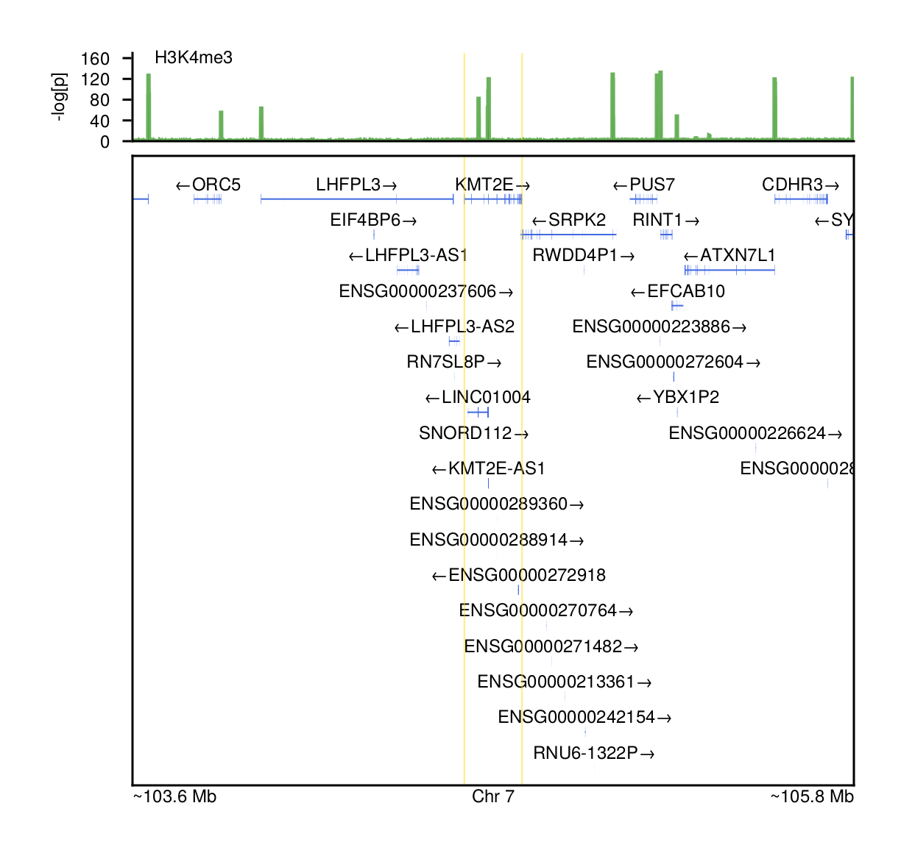
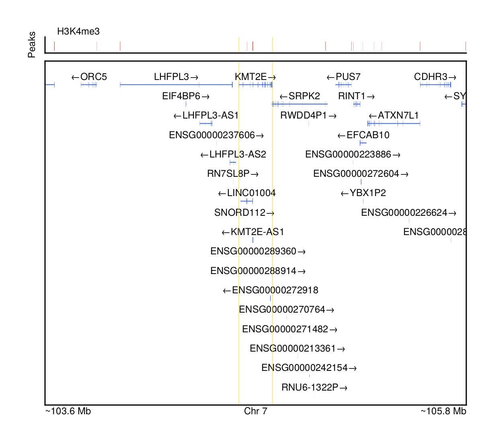
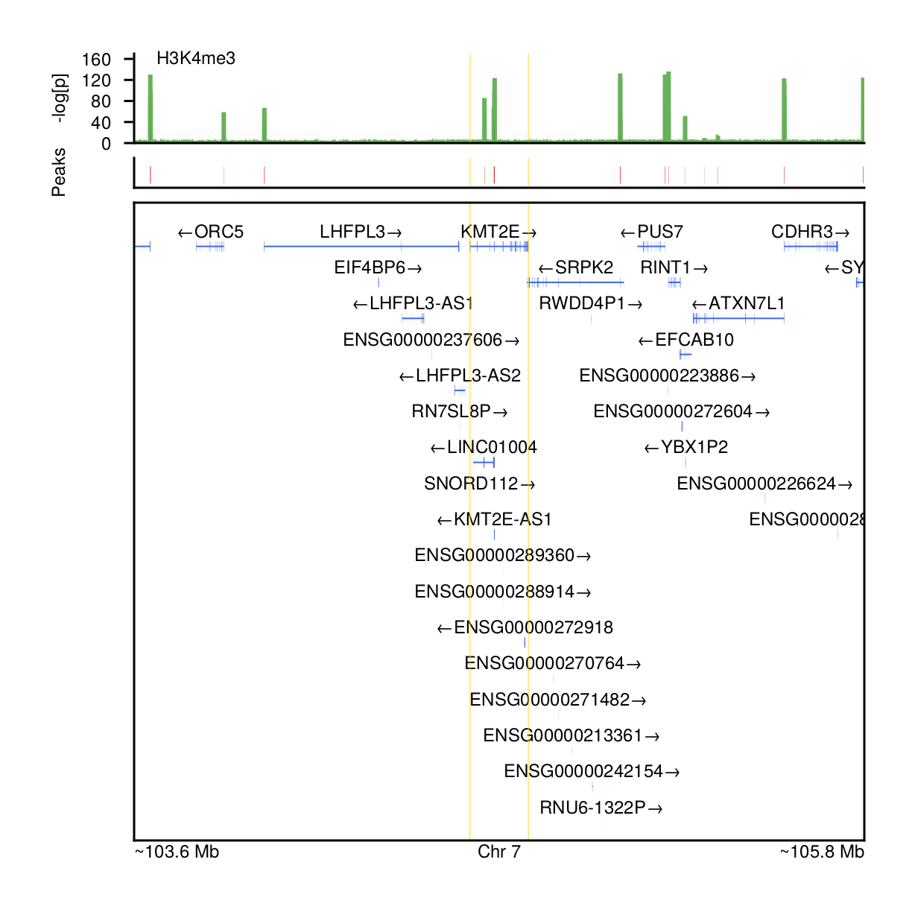

# Plotting peaks

Epigenetic sequencing is another data modality of interest that we can
visualize with [__Makie.jl__](https://makie.juliaplots.org/stable/) and
GeneticsMakie.jl. ChIP-seq and ATAC-seq map epigenetic modifications throughout the genome by identifying DNA-protein interaction sites and open chromatin sites respectively, and although they capture different aspects of the epigenome, their resulting data share the same form and function (i.e. BAM files to capture reads, WIG files to capture coverage and signal, BED files to capture peaks). Consequently, visualizing both types of data will follow the same workflow.

We will start with the annotation from [Parsing GENCODE](@ref). Accompanying
ChIP-seq data will be downloaded from the
[ENCODE project](https://www.encodeproject.org/).

```julia
using Pkg
Pkg.add(["GeneticsMakie", "CairoMakie", "Makie", "CSV", "DataFrames", "Arrow", "BigWig"])
```

```julia
using GeneticsMakie, CairoMakie, Makie, CSV, DataFrames, Arrow, Downloads, BigWig
url = "https://ftp.ebi.ac.uk/pub/databases/gencode/Gencode_human/release_39/GRCh37_mapping/gencode.v39lift37.annotation.gtf.gz"
gencode = Arrow.Table("data/gencode/$(splitext(basename(url))[1]).arrow")|> DataFrame
```

```julia
chipseq = Dict(
    "continuous" => "https://www.encodeproject.org/files/ENCFF343VSH/@@download/ENCFF343VSH.bigWig",
    "peaks" => "https://www.encodeproject.org/files/ENCFF938RRM/@@download/ENCFF938RRM.bed.gz"
)
isdir("data/chipseq") || mkdir("data/chipseq")
for key in keys(chipseq)
    url = chipseq[key]
    isfile("data/chipseq/$(basename(url))") || Downloads.download(url, "data/chipseq/$(basename(url))")
end
```

We can generate a track visualizing ChIP-seq data continuously over a locus.
Here, we plot P values from processing the ChIP-seq data through
[MACS2](https://pypi.org/project/MACS2/), which are based on the null hypothesis that
the signal at that site is also present in the control. Continuous data like
this is often stored in bigWig files, which store dense, continuous data in
indexed binary files. Other types of continuous data can be stored and
delivered through this format: BAM files can be converted to the bigWig format
in order to convey read coverage over the genome. We will use
[__BigWig.jl__](https://biojulia.net/BigWig.jl/dev/) to read in this
data to plot.

```julia
gene = "KMT2E"
chr, start, stop = GeneticsMakie.findgene(gene, gencode)
ranges = [start - 1e6, stop + 1e6]

begin
    f = Figure(resolution = (306, 792))
    axs = [Axis(f[i, 1]) for i in 1:2]
    ax = axs[1]
    reader = open(BigWig.Reader, "data/chipseq/$(basename(chipseq["continuous"]))")
    xs = Float64[]
    ys = Float64[]
    for record in BigWig.GenomicFeatures.eachoverlap(
        reader,
        BigWig.Interval("chr$(chr)", Int64(ranges[1]), Int64(ranges[2]))
        )
        push!(xs, BigWig.chromstart(record)) # extract position
        push!(ys, BigWig.value(record)) # extract -log₁₀(p)
    end
    band!(ax, xs, fill(0, length(xs)), ys; color = ("#389826", 0.75))
    lines!(ax, xs, ys; color = ("#389826", 0.75))
    rowsize!(f.layout, 1, 30)
    close(reader)
    Label(f[1, 1, Top()], "H3K4me3", fontsize = 6, halign = :left, padding = (7.5, 0, -5, 0))
    ymax = max(10, maximum(ys) * 1.25)
    ax.spinewidth = 0.75
    ax.ytickwidth = 0.75
    ax.ylabelsize = 6
    ax.yticklabelsize = 6
    ax.yticksize = 3
    if ymax == 10
        ax.yticks = 0:3:10
    elseif 10 < ymax <= 20
        ax.yticks = 0:5:ymax
    elseif 20 < ymax <= 50
        ax.yticks =  0:10:ymax
    else
        s = div(ymax, 4)
        d, r = divrem(s, 10)
        if r < 5 
            ax.yticks = (0:10d:ymax)
        else
            ax.yticks = (0:((d + 1) * 10):ymax)
        end
    end
    xlims!(ax, ranges[1], ranges[2])
    ylims!(ax, 0, ymax)
    hidespines!(ax, :t, :r)
    hidexdecorations!(ax)
    hideydecorations!(ax, ticks = false, label = false, ticklabels = false)
    rs = GeneticsMakie.plotgenes!(axs[2], chr, ranges[1], ranges[2], gencode; height = 0.1)
    rowsize!(f.layout, 2, rs)
    GeneticsMakie.labelgenome(f[2, 1, Bottom()], chr, ranges[1], ranges[2])
    Label(f[1, 0], text = "-log[p]", fontsize = 6, rotation = pi / 2)
    rowgap!(f.layout, 5)
    colgap!(f.layout, 5)
    for i in 1:2
        vlines!(axs[i], start, color = (:gold, 0.5), linewidth = 0.5)
        vlines!(axs[i], stop, color = (:gold, 0.5), linewidth = 0.5)
    end
    resize_to_layout!(f)
    f
end
```


An alternative way to visualize ChIP-seq data is by drawing the peaks only.
There are various tools for calling peaks, and for the most part they output
the peaks in a BED file or a similar format. Here we load in and draw peaks
called by [MACS2](https://pypi.org/project/MACS2/).

```julia
begin
    using Makie.GeometryBasics
    f = Figure(resolution = (306, 792))
    axs = [Axis(f[i, 1]) for i in 1:2]
    ax = axs[1]
    narrowpeak_header =
        [:chrom, :start, :stop, :name, :score, :strand,
        :signalvalue, :nlog₁₀pvalue, :nlog₁₀qvalue, :peak]
    df = CSV.read("data/chipseq/$(basename(chipseq["peaks"]))", DataFrame;
        header = narrowpeak_header)
    subset!(df,
        :chrom => col -> col .== "chr$(chr)",
        [:start, :stop] => (start, stop) ->
            (start .< ranges[2]) .&& (stop .> ranges[1])
        )
    for row in eachrow(df)
        peakpoly = Polygon(
            Point2f[(row.start, 0), (row.start, 10),
                (row.stop, 10), (row.stop, 0)])
        poly!(ax, peakpoly; color = "#CB3C33")
    end
    ax.spinewidth = 0.75
    hidexdecorations!(ax)
    hideydecorations!(ax)
    xlims!(ax, ranges[1], ranges[2])
    ylims!(ax, -10 * .25, 10 * 1.5)
    hidespines!(ax, :t, :r)
    rowsize!(f.layout, 1, 10)
    rs = GeneticsMakie.plotgenes!(axs[2], chr, ranges[1], ranges[2], gencode; height = 0.1)
    rowsize!(f.layout, 2, rs)
    GeneticsMakie.labelgenome(f[2, 1, Bottom()], chr, ranges[1], ranges[2])
    Label(f[1, 0], text = "Peaks", fontsize = 6, rotation = pi / 2)
    Label(f[1, 1, Top()], "H3K4me3", fontsize = 6, halign = :left, padding = (7.5, 0, 0, 0), tellwidth = false)
    rowgap!(f.layout, 5)
    colgap!(f.layout, 5)
    for i in 1:2
        vlines!(axs[i], start, color = (:gold, 0.5), linewidth = 0.5)
        vlines!(axs[i], stop, color = (:gold, 0.5), linewidth = 0.5)
    end
    resize_to_layout!(f)
    f
end
```


Finally, using [__Makie.jl__](https://makie.juliaplots.org/stable/)'s default layout tools, we
can visualize both the continuous track and the called peaks simultaneously.

```julia
begin
    f = Figure(resolution = (306, 792))
    axs = [Axis(f[i, 1]) for i in 1:3]
    ax = axs[1]
    reader = open(BigWig.Reader, "data/chipseq/$(basename(chipseq["continuous"]))")
    xs = Float64[]
    ys = Float64[]
    for record in BigWig.GenomicFeatures.eachoverlap(
        reader,
        BigWig.Interval("chr$(chr)", Int64(ranges[1]), Int64(ranges[2]))
        )
        push!(xs, BigWig.chromstart(record)) # extract position
        push!(ys, BigWig.value(record)) # extract -log₁₀(p)
    end
    band!(ax, xs, fill(0, length(xs)), ys; color = ("#389826", 0.75))
    lines!(ax, xs, ys; color = ("#389826", 0.75))
    rowsize!(f.layout, 1, 30)
    close(reader)
    Label(f[1, 1, Top()], "H3K4me3", fontsize = 6, halign = :left, padding = (7.5, 0, -5, 0))
    ymax = max(10, maximum(ys) * 1.25)
    ax.spinewidth = 0.75
    ax.ytickwidth = 0.75
    ax.ylabelsize = 6
    ax.yticklabelsize = 6
    ax.yticksize = 3
    if ymax == 10
        ax.yticks = 0:3:10
    elseif 10 < ymax <= 20
        ax.yticks = 0:5:ymax
    elseif 20 < ymax <= 50
        ax.yticks =  0:10:ymax
    else
        s = div(ymax, 4)
        d, r = divrem(s, 10)
        if r < 5 
            ax.yticks = (0:10d:ymax)
        else
            ax.yticks = (0:((d + 1) * 10):ymax)
        end
    end
    xlims!(ax, ranges[1], ranges[2])
    ylims!(ax, 0, ymax)
    hidespines!(ax, :t, :r)
    hidexdecorations!(ax)
    hideydecorations!(ax, ticks = false, label = false, ticklabels = false)
    ax = axs[2]
    narrowpeak_header =
        [:chrom, :start, :stop, :name, :score, :strand,
        :signalvalue, :nlog₁₀pvalue, :nlog₁₀qvalue, :peak]
    df = CSV.read("data/chipseq/$(basename(chipseq["peaks"]))", DataFrame;
        header = narrowpeak_header)
    subset!(df,
        :chrom => col -> col .== "chr$(chr)",
        [:start, :stop] => (start, stop) ->
            (start .< ranges[2]) .&& (stop .> ranges[1])
        )
    for row in eachrow(df)
        peakpoly = Polygon(
            Point2f[(row.start, 0), (row.start, 10),
                (row.stop, 10), (row.stop, 0)])
        poly!(ax, peakpoly; color = "#CB3C33")
    end
    ax.spinewidth = 0.75
    hidexdecorations!(ax)
    hideydecorations!(ax)
    xlims!(ax, ranges[1], ranges[2])
    ylims!(ax, -10 * .25, 10 * 1.5)
    hidespines!(ax, :t, :r)
    rowsize!(f.layout, 2, 10)
    rs = GeneticsMakie.plotgenes!(axs[3], chr, ranges[1], ranges[2], gencode; height = 0.1)
    rowsize!(f.layout, 3, rs)
    GeneticsMakie.labelgenome(f[3, 1, Bottom()], chr, ranges[1], ranges[2])
    Label(f[1, 0], text = "-log[p]", fontsize = 6, rotation = pi / 2)
    Label(f[2, 0], text = "Peaks", fontsize = 6, rotation = pi / 2)
    rowgap!(f.layout, 5)
    colgap!(f.layout, 5)
    for i in 1:3
        vlines!(axs[i], start, color = (:gold, 0.5), linewidth = 0.5)
        vlines!(axs[i], stop, color = (:gold, 0.5), linewidth = 0.5)
    end
    resize_to_layout!(f)
    f
    save("ss4.png",f, px_per_unit = 4)
end
```
