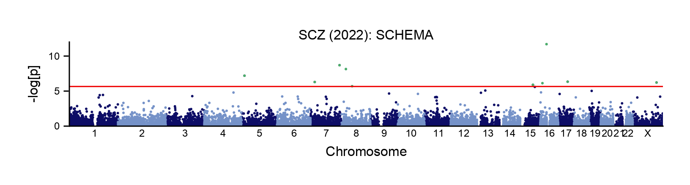

# Plotting TWAS

One can also visualize gene-level association results using `GeneticsMakie.plotgwas!`.
Here we focus on the results of meta analysis of gene-level burden test from case and control studies
and gene-level Poisson test from family trio studies for schizophrenia.

```julia
using Pkg
Pkg.add(["GeneticsMakie", "CairoMakie", "CSV", "DataFrames", "Arrow"])
```

```julia
using GeneticsMakie, CairoMakie, CSV, DataFrames, Arrow, Downloads
url = "https://ftp.ebi.ac.uk/pub/databases/gencode/Gencode_human/release_39/GRCh37_mapping/gencode.v39lift37.annotation.gtf.gz"
gencode = Arrow.Table("data/gencode/$(splitext(basename(url))[1]).arrow")|> DataFrame
Downloads.download("https://atgu-exome-browser-data.s3.amazonaws.com/SCHEMA/SCHEMA_gene_results.tsv.bgz", "data/gwas/SCHEMA_gene_results.tsv.bgz")
df = CSV.read("data/gwas/SCHEMA_gene_results.tsv.bgz", DataFrame)
```

The key is to calculate coordinates for each gene in the summary statistics.

```julia
df.CHR .= "1"
df.BP .= -1.5
storage = filter(x -> x.feature == "gene", gencode)
for i in 1:nrow(df)
    ind = findfirst(isequal(df.gene_id[i]), storage.gene_id)
    isnothing(ind) ? continue : nothing
    df.CHR[i] = storage.seqnames[ind]
    df.BP[i] = (storage.start[ind] + storage.end[ind]) / 2
end
rename!(df, "P meta" => "P")
dropmissing!(df, :P)
filter!(x -> x.P != "NA", df)
df.P = parse.(Float64, df.P)
```

```julia
f = Figure(resolution = (408, 792))
ax = Axis(f[1, 1])
GeneticsMakie.plotgwas!(ax, df; ymax = 13, p = 2.2e-6)
hidespines!(ax, :t, :r)
Label(f[1, 1, Top()], text = "SCZ (2022): SCHEMA", fontsize = 8)
rowsize!(f.layout, 1, 50)
resize_to_layout!(f)
f
```
