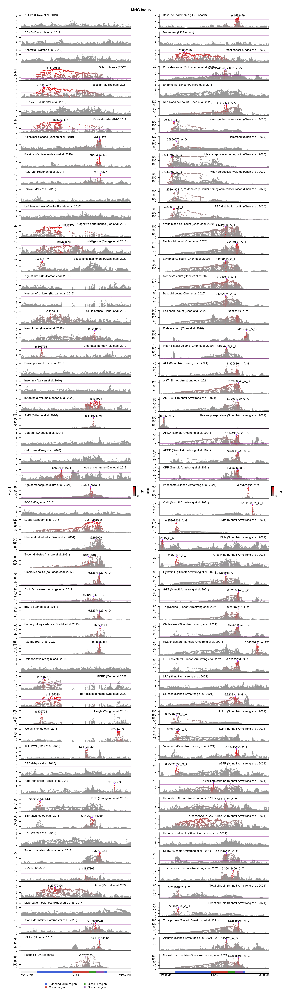

```@meta
CurrentModule = GeneticsMakie
```

# GeneticsMakie

The goal of [__GeneticsMakie.jl__](https://github.com/mmkim1210/GeneticsMakie.jl) is to 
permit seamless data visualization and exploratory data analysis of the human genome within
the larger [Julia data science](https://github.com/JuliaData) and [__OpenMendel__](https://github.com/OpenMendel) ecosystems.
The package provides convenient wrapper functions for wrangling genetic association results and 
plotting them using [__Makie.jl__](https://makie.juliaplots.org/stable/). Every component of a figure 
can be easily customized and extended, and the package generates high-quality, publication-ready figures.



!!! tip "Getting started"
    Please peruse the documentations of 
    [__Makie.jl__](https://makie.juliaplots.org/stable/), 
    [__CSV.jl__](https://csv.juliadata.org/stable/), 
    [__DataFrames.jl__](https://dataframes.juliadata.org/stable/), 
    and [__SnpArrays.jl__](https://openmendel.github.io/SnpArrays.jl/latest/). 
    Familiarity with these packages will allow visualization of most types of genetic and genomic data. 
    [__Makie.jl__](https://makie.juliaplots.org/stable/)'s default layout tools are particularly useful for 
    plotting different genetic and genomic data modalities as separate layers.

!!! note "An usage case"
    If you have run a genome-wide association study (GWAS) at the variant-level, 
    and you would like to eyeball genome-wide significant loci across hundreds of
    phenotypes, then you are in the right place.